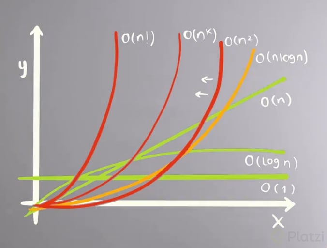

Resolver un problema es entender como mezclar y aplicar los siguientes conceptos volviendo la solución elegante pero a la vez lo mas sencilla posible: - Patrones - Estructuras de datos - Algoritmos

# Estructura de Datos:

    - Arreglos
    - String
    - Listas encadenadas
    - Tablas de Hash y Conjuntos de Hash
    - Pilas
    - Colas
    - Arboles
    - Grafos
    - Tries

# Algoritmos

    - Notacion Big O
    - Algoritmos de Ordenamiento
    - Algoritmos de búsqueda
    - DFS y BFS
    - Manipulación de bits
    - Recursión
    - Programación dinámica

# Patrones

    - Dos apuntadores
    - Ventana Deslizante
    - Apuntador rápaido y lento
    - Entre otros

## CURVA DE COMPLEJIDAD ALGORITMICA

Notación Big O : Metrica para describir la cantidad de recursos que utilizamos al ejecutar un algoritmo.

### Complejidad Lineal -> 0(1)

A continuación puedes ver algunas de las funciones que definen la complejidad de un algoritmo.

En dónde las funciones de más a menos eficientes son:

O(1)
O(log n)
O(n)
O(n log n)
O(n^2)
O(n^3)
O(n^k)
O(n!)
